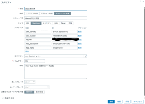
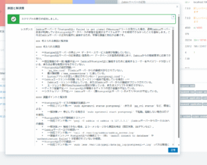

# Zabbixで始めるAIOPS

Zabbixは強力なオープンソース監視ソリューションですが、実際の運用現場では「検知した障害にどう対応するか」という部分で、運用者の経験やナレッジに頼るケースが多いと思います。
そこで今回は、[Zabbix公式ブログの記事](https://blog.zabbix.com/creating-a-personal-assistant-in-zabbix-with-artificial-intelligence/29596/) を参考にしながら、Zabbixの「スクリプト」機能とGoogle Gemini APIを組み合わせ、**障害の原因や対応方法を自動で提案してくれる“運用アシスタント”** を作ってみました。おそらくGemini以外でも動作します。

最近注目されている **AIOps（Artificial Intelligence for IT Operations）** の入り口となる取り組みといえるかも。

---

## 仕組みの概要

* **使ったZabbixのマクロ**

  * `{EVENT.SEVERITY}`（障害の深刻度）
  * `{TRIGGER.NAME}`（障害内容）
  * `{HOST.DESCRIPTION}`（ホストの説明）
  * `{HOST.HOST}`（ホスト名）
  * マクロ以外にGemini(等)のAPIKeyも必要です

  * Zabbixのスクリプトに記述したコード
~~~script
var Gemini = {
    params: {},
    setParams: function(params) {
        if (typeof params !== 'object') {
            return;
        }
        Gemini.params = params;
        if (typeof Gemini.params.api_key !== 'string' || Gemini.params.api_key === '') {
            throw 'API key for Gemini is required.';
        }
        Gemini.params.url = 'https://generativelanguage.googleapis.com/v1beta/models/gemini-2.5-flash:generateContent';
    },
    request: function(data) {
        if (!Gemini.params.api_key) {
            throw 'API key is missing.';
        }
        var request = new HttpRequest();
        request.addHeader('Content-Type: application/json');
        
        // Construir URL con API key
        var urlWithKey = Gemini.params.url + '?key=' + Gemini.params.api_key;
        
        Zabbix.log(4, '[ Gemini Webhook ] Sending request: ' + urlWithKey + '\n' + JSON.stringify(data));
        var response = request.post(urlWithKey, JSON.stringify(data));
        Zabbix.log(4, '[ Gemini Webhook ] Received response with status code ' + request.getStatus() + '\n' + response);
        
        if (request.getStatus() < 200 || request.getStatus() >= 300) {
            throw 'Gemini API request failed with status code ' + request.getStatus() + '.';
        }
        
        try {
            response = JSON.parse(response);
        } catch (error) {
            Zabbix.log(4, '[ Gemini Webhook ] Failed to parse response from Gemini.');
            response = null;
        }
        return response;
    }
};

try {
    var params = JSON.parse(value),
        data = {},
        result = "",
        required_params = ['alert_subject'];
    var params = JSON.parse(value),
        data = {},
        result = "",
        required_params = ['host_name'];
    var params = JSON.parse(value),
        data = {},
        result = "",
        required_params = ['host_description'];        
    var params = JSON.parse(value),
        data = {},
        result = "",
        required_params = ['alet_severity'];        

    Object.keys(params).forEach(function(key) {
        if (required_params.indexOf(key) !== -1 && params[key] === '') {
            throw 'Parameter "' + key + '" cannot be empty.';
        }
    });

    // Formatear la consulta para Gemini
    data = {
        contents: [{
            parts: [{
                text: "Zabbixが深刻度: " + params.alert_severity + "の障害: " + params.alert_subject + "を、ホスト：" + params.host_name + "で検知しました。 " +
                      "このホストの概要は: " + params.host_description + "です。 " +
                      "この障害を解決するために、考えられる原因と解決策を提案してください。箇条書きで出力してください。 " +
                      "20行程度で、障害原因、調査ポイント 対応コマンド、作業時のリスク、将来のインシデントを軽減するための対策などを記載してください。"
            }]
        }]
    };

    // Configurar la API de Gemini
    Gemini.setParams({ api_key: params.api_key });
    
    // Hacer la solicitud a Gemini
    var response = Gemini.request(data);
    
    if (response && response.candidates && response.candidates.length > 0) {
        result = response.candidates[0].content.parts[0].text.trim();
    } else {
        throw 'No response from Gemini.';
    }
    
    return result;
    
} catch (error) {
    Zabbix.log(3, '[ Gemini Webhook ] ERROR: ' + error);
    throw 'Sending failed: ' + error;
}
~~~

* **動作イメージ**

  1. Zabbixが障害を検知
  2. 上記の情報をスクリプト経由でGemini APIに渡す
  3. AIが「障害原因・調査ポイント・対応コマンド・リスク・将来の予防策」をまとめて返す
  4. 結果がZabbix上の通知に表示される

---

## 出力例

たとえば「ICMP Pingが失敗した」という障害では、AIから以下のような提案が返ってきます。

* ネットワーク断、ルータ障害の可能性
* ICMP応答がOSレベルで無効化されている可能性
* 疎通確認コマンド: `ping` / `traceroute`
* リスク: 調査時に本番トラフィックへ影響が出る可能性あり
* 予防策: 冗長化やサービスレベル監視の導入

従来であれば運用担当者がマニュアルや過去ナレッジを参照して判断していた部分を、**AIが即時に候補を提示してくれる**のが大きなポイントです。

---

## メリット（運用担当者視点）

* 初動対応のスピードが上がる
* 経験の浅いメンバーでも調査を進めやすい
* チーム内のナレッジ不足を補える
* 将来的にはナレッジベース化して“学習する運用”に発展可能

---

## まとめ

今回の仕組みはシンプルですが、**「監視データ＋AI」＝ AIOpsの第一歩** としてとても有効です。
Zabbixユーザーであれば、スクリプトにGemini APIキーを設定するだけで再現可能なので、ぜひ試してみてください。

運用の現場にAIを取り入れることで、単なる監視ツールから「運用支援ツール」へと進化させることができます。

---

次のステップとしては、AIの提案を **Zabbixのアクションメッセージ** に組み込んだり、**チケットシステム連携**に拡張すれば、さらに実運用での効果が高まると思います。
他にも **「イベント一覧をExcelに取り込んでそれぞれの対応内容をLLMに埋めてもらう」** とか **「一定期間のメトリックを取得してpythonにグラフを描いてもらってメトリックとグラフをLLMに送ってレポートを描いてもらう」** とか運用の定常業務を自動化したノウハウもありますのでおいおい公開していきます。
最後にもう１つ、これらを **オンプレミスで完結させることが可能です** オンプレミスだからって諦める必要はないんです。 **オンプレミスでもAIOPS** やっていきましょう！

---