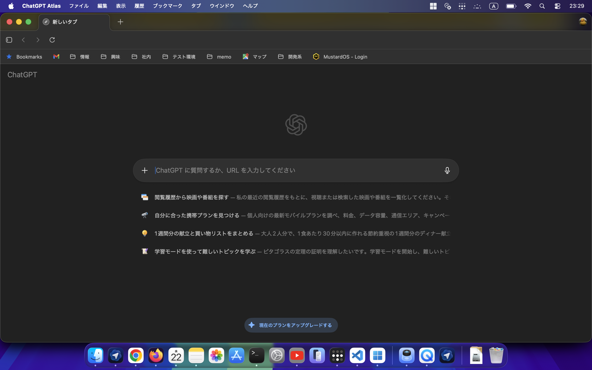

# 雑談系（最近つかって気に入ったツール達）その１

## ChatGPT Atlasブラウザ
PerplexityのCometは聞いていたし、Google検索のGemini連携(夏にはGemini in Chromeもリリースされた)、Edgeが検索結果でcopilotを全面に押し出してきてるのもあって、本家OpenAIがリリースしたのもあって使ってみた。

**ChatGPT Atlas開始画面**

**ChatGPT Atlas検索結果画面**

もともと普段のGoogle検索にしたところでサイト検索の結果より「AIによる概要」を見てさらに調べるときはAIモードを使ってたので『まぁブラウザの現状における正常な進化だよな』って感想。

人間は使える時間が限られてる。
「検索」を行うのは「検索」が目的でなく「答えを導く過程」でしかない。
なんならその「答え」もなにか目的のために得たいのであって、「答え合わせ」で満足な人ってごく一部だと思う（自分がそっち側なので少数派かどうかの判断は主観が混じってる）。

そういう意味で「答えを出す」に特化した、なんならエージェント化されて簡単なタスクはこなせてしまうブラウザは現時点で**究極のツール**だと思う。

課題はある。
* Googleの「AIによる要約」リリース後から顕著になったGoogleからの流入の激減
  * コンテンツへのトラフィックが減ると、コンテンツからの収益が減少しコンテンツを作成する側のモチベーションが低下する
  * 結果AIの学習元の品質が下がりAIそのものの成長に影響を及ぼす
* エージェントの完成度
  * 以下はAtlasブラウザに
  「日本の過去30年のお米の消費者価格を調べて表とグラフを作成してください。お米の消費者価格は （A）小売の実際の単価（5kg袋の円額）でお願いします。取得可能な最新データから過去30年分でいいです。データがない年はプロットしなくていいです。」
  という質問を投げた回答。
~~~Document
  了解しました — では （私が直接ウェブから数値を取得して加工する代わりに）、公的データ（総務省 小売物価統計 / e-Stat の「主要品目の都市別小売価格」データベース）を自動で取得して「袋入り（5kg）あたりの小売価格（円/5kg）」の年次平均（過去30年分、利用可能な年だけ）を計算して、表（CSV）とグラフを作る Python スクリプトを作成します。
 （理由：e-Stat の DB ページや Excel/CSV は公開されており取得可能ですが、この対話環境から直接すべてのファイルを安定してダウンロードする際に技術的な制約がありました。そこで「すぐに再現できるコード」をお渡しし、ワンクリックまたは一行でローカルで実行できる形にします。実行していただければ最新データまで自動で取得して表とグラフを生成します。）
下に置くスクリプトは次を自動化します。
・e-Stat（総務省の DB：小売物価統計 — 主要品目の都市別小売価格）から該当時系列（袋入り・5kg の精米小売価格）を取得（API or CSV）
・月次データを年次平均に集計（年ごとの平均価格 円／5kg）
・直近の最新公表年まで（可能なら 1996〜最新 のうち「5kgデータがある年」）を出力。データが無い年は欠損としてプロットしません。
・結果を rice_5kg_price_by_year.csv として保存し、PNG のグラフ rice_5kg_price_by_year.png を作成。
※（オプション）銘柄別（コシヒカリ／それ以外）で分けたい場合は簡単に切り替え可能。

以下がその 完全な実行可能スクリプト（Python） です。ローカルに Python 3.9+ が入っていれば動きます。必要なパッケージは requests, pandas, matplotlib だけです（pip でインストールしてください）。

Python スクリプト（そのまま実行できます）
# rice_price_fetch_and_plot.py
# 実行: python rice_price_fetch_and_plot.py
# 必要: pip install requests pandas matplotlib

import requests
import io
import zipfile
import pandas as pd
import matplotlib.pyplot as plt
import sys
from datetime import datetime

"""
このスクリプトは e-Stat の「小売物価統計調査（主要品目の都市別小売価格）」データベースから
'袋入り(5kg)' の精米（うるち米）に該当する時系列データを取得して年次平均を計算、CSV とグラフを出力します。

注意:
- e-Stat API を使う場合は API key が必要ですが、e-Stat の DB ページから取得できるCSVの直接リンクを使用する方法もあります。
- 下の 'DATA_URL' は e-Stat の DB ビューの "ダウンロード" に相当するURLに置き換えてください（もしくはブラウザで該当CSVのリンクを得て貼り付け）。
- スクリプトは「全国・東京都区部・都市別」などのCSVを想定して汎用的な列名処理を行いますが、実際のファイルのフォーマットにより微調整が必要な場合があります。
"""

# === ここにCSV/ExcelのURLを指定してください ===
# (推奨) e-Stat の該当 DB ビュー (sid=0003421913) のCSVダウンロードURLを指定します。
# 例(ダミー): DATA_URL = "https://www.e-stat.go.jp/stat-search/file-download?statInfId=0003421913&fileKind=0"
DATA_URL = None

if not DATA_URL:
    print("ERROR: DATA_URL をセットしてください。")
    print("手順:")
    print(" 1) https://www.e-stat.go.jp/ で「小売物価統計調査 主要品目の都市別小売価格 (2000年1月〜)」を開く")
    print(" 2) 'CSV' または 'DB' のダウンロードリンクを取得し、そのURLをこのスクリプトの DATA_URL に貼り付けて再実行してください。")
    sys.exit(1)

# 取得
print("Downloading data from:", DATA_URL)
r = requests.get(DATA_URL)
r.raise_for_status()
ーー以下略ーー
~~~
いや、これを一般コンシューマー向けの回答にしちゃいかんでしょ・・・なんで**Pythonの実行環境があるのが前提**なんだよ。

**未来まではまだすこし足りない。**

とはいえ、うちの女子大生（文系）の娘は「**Python?使ったことあるよー**。1年後期で『ITリテラシー・データ処理』みたいなので**プログラム書かされたー**。」って言ってたんで今が未来なのかもしれない。
さすが**デジタルネイティブなZ世代**。
ゆとり〜氷河期あたりの年代の人は危機感持ってね。

